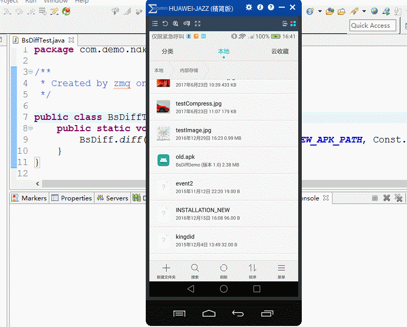

# BsDiffUpdate
    本项目中增量更新整体实现思路是服务器利用新旧版本APK生成对应的差分包，客户端app检测更新后下载对应版本的差分包，在手机端合并生成新版APK然后安装从而实现版本更新，相较于传统的全量更新更加快速高效，能够为服务器节省很多带宽成本，同时为用户节省流量。
    具体代码实现过程详见：http://blog.csdn.net/qq_15342987/article/details/77018418

实现效果如下；
    

